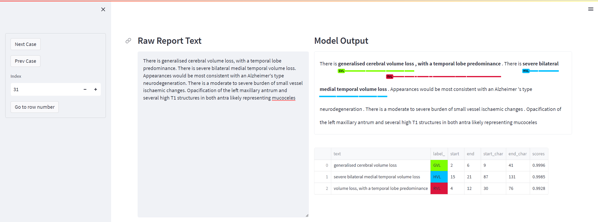

# brain-mri-nlp
This repository contains a project files, scripts and configs written during the development of a spaCy span categorisation NLP project for the automated extraction of mentions of volumetric assessment from brain MRI reports in a memory clinic context.

## project.yml

The [`project.yml`](project.yml) defines the data assets required by the project, as well as the available commands and workflows. For details, see the [spaCy projects documentation](https://spacy.io/usage/projects).

### Commands

The following new commands are defined within the project.yml project file. They can be executed using [`spacy project run [name]`](https://spacy.io/api/cli#project-run).

- `visualize-model`
  - Visualize the model's output interactively using Streamlit. This is based on the [spacy-streamlit](https://github.com/explosion/spacy-streamlit) source, with additions to customise colours for each category (with matching formatting in the output table below), add the spancat component scores to the output table with formatting options, navigation through records and also allows dynamic text input (enter text in the left hand box and then Ctrl+Enter).
  - Once run from the command line this will provide a URL to view the streamlit output.
  - Example output (NB: not real patient data!):
  - 
- `evaluate-kfold`
  - Evaluate using k-fold cross validation, with the number of folds in project.yml. This is heavily based on [this GitHub project](https://github.com/ljvmiranda921/ud-tagalog-spacy).
  - This has been updated to output all of the metrics for each span category for each fold to ./metrics/kfold.jsonl (once all folds are completed), not just the average of the top-level precision/recall/f-score. This is useful if wanting to assess performance on a per-fold and/or per-category basis.
  - Also added further information at the end of each fold to output the appended metrics and add a timestamp (this is useful for debugging and sanity checking in situations where running the full number of folds may take a non-trivial amount of time).
  - Also added wandb (weights & biases) integration, although this only outputs the final scores for each fold and does not do the dynamic tracking while each fold is training. However, this is not really required and is still useful for running experiments / hyperparamter tuning.
- `find-threshold`
  - This adds the new spacy find-threshold CLI command to the project, purely to ensure consistent usage.
  
## Scripts

- [visualize-model.py](/scripts/visualize-model.py)
- [kfold.py](/scripts/kfold.py)
- [functions.py](/scripts/functions.py)
  - Added for the purposes of defining a custom logging function (which here is simply spaCy's wandb_logger_v5) for usage with the kfold evaluation, ultimately not needed but included for completeness

## Configs
These are included for the purposes of making them publically available.
